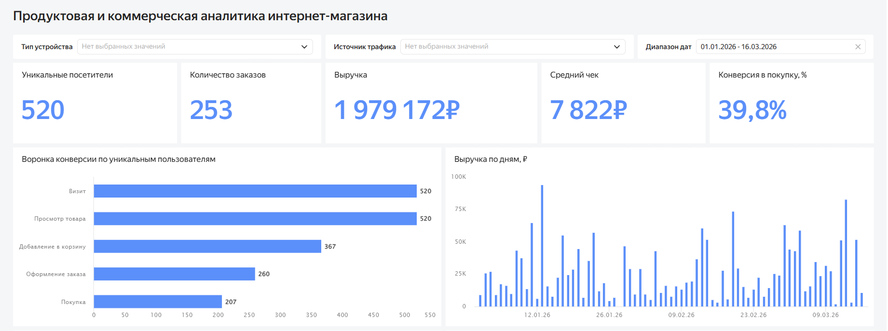
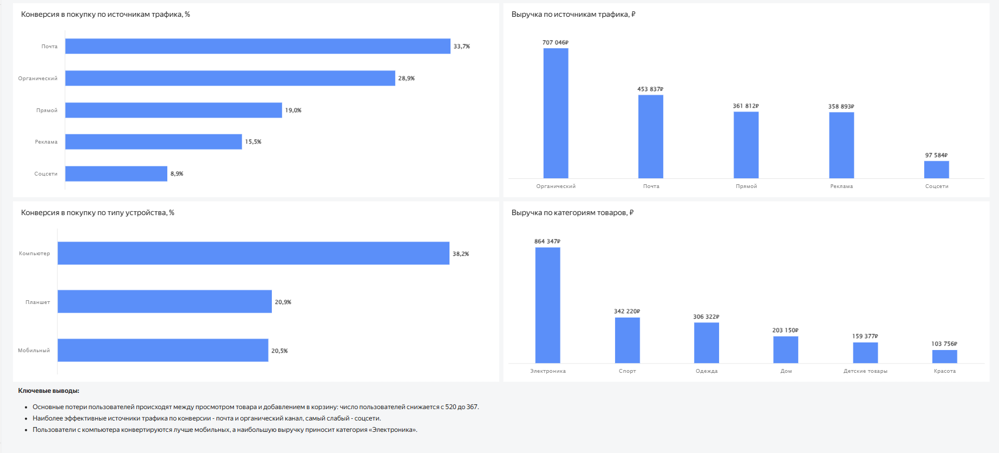

# Анализ воронки конверсии и выручки интернет-магазина

## О проекте
В этом проекте я проанализировал события пользователей интернет-магазина, чтобы понять, как пользователи проходят путь от визита до покупки, на каких этапах теряются и какие сегменты показывают более высокую конверсию и выручку.

Основная задача — найти проблемные места в воронке, сравнить источники трафика и типы устройств, а также собрать результаты в понятный дашборд.

## Цель проекта
Понять, на каком этапе воронки интернет-магазин теряет больше всего пользователей, какие источники трафика приводят более качественную аудиторию и какие сегменты дают наибольшую выручку.

## Что было сделано
- загружены и проверены данные о событиях пользователей интернет-магазина;
- выполнен базовый анализ данных и проверка пропусков;
- рассчитаны ключевые метрики: уникальные посетители, количество заказов, выручка, средний чек и конверсия в покупку;
- построена воронка по уникальным пользователям от визита до покупки;
- выполнено сравнение источников трафика по конверсии и выручке;
- проанализирована конверсия по типам устройств;
- оценена выручка по категориям товаров;
- собран итоговый дашборд в Yandex DataLens.

## Инструменты
- Python
- Pandas
- SQL
- SQLite
- Yandex DataLens

## Ноутбук
В ноутбуке `notebooks/01_eda_and_funnel.ipynb` выполнены загрузка данных, базовая проверка качества, расчёт ключевых метрик и построение воронки через SQL.

## Дашборд
[Открыть дашборд в Yandex DataLens](https://datalens.yandex/pq25dlwxcquq9)

## Превью

## Структура репозитория
- data/events.csv — исходные данные
- notebooks/01_eda_and_funnel.ipynb — ноутбук с анализом данных
- sql_requests/01_funnel_conversion.sql — SQL-запрос для расчёта воронки
- dashboard/dashboard_main_top.png — верхняя часть дашборда
- dashboard/dashboard_main_bottom.png — нижняя часть дашборда

## Ключевые метрики
- Уникальные посетители — 520
- Количество заказов — 253
- Выручка — 1 979 172 ₽
- Средний чек — 7 822 ₽
- Конверсия в покупку — 39,8%

## Основные выводы
1. Основные потери пользователей происходят между просмотром товара и добавлением в корзину.
2. Наиболее эффективные источники трафика по конверсии — почта и органический канал.
3. Пользователи с компьютера конвертируются лучше мобильных устройств.
4. Наибольшую выручку приносит категория «Электроника».

## Что можно сделать дальше
- дополнительно изучить этап перехода от просмотра товара к добавлению в корзину;
- отдельно проверить сценарий покупки с мобильных устройств;
- оценить эффективность перераспределения трафика в пользу более сильных каналов;
- подробнее проанализировать категории, которые дают основной вклад в выручку.

